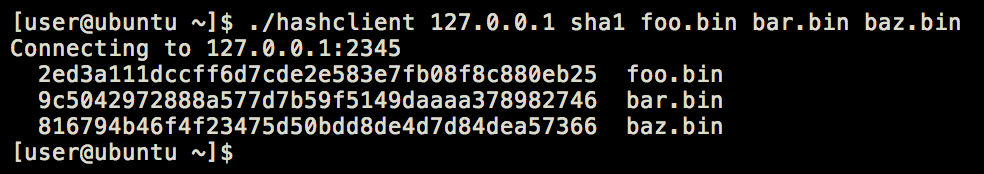

# Network Hashing Server
___

## Overview
Write a network server and client for cryptographically hashing files. The hashing server will be listening on the network. The client will connect to the server, indicate the desired hashing algorithm, upload the file, and receive the hash of the file. The client will then display the hash
___

## Server Requirements
1. [ ] The server must be written in Python. 
1. [ ] The server must support Python 3.6+
1. [ ] The server must accept the following arguments:
   1. [ ] Port: The TCP port to listen on. This argument is optional.
___

## Client Requirements
1. [ ] The client must be written in C.
1. [ ] The client must compile using gcc on `Ubuntu 20.04`.
1. [ ] The client will be executed on `Ubuntu 20.04`.
1. [ ] The client must accept the following arguments:
   1. [ ] **Port**: The TCP port to connect on. This argument is optional.
   1. [ ] **Address**: The IP address where the server is listening. This argument is mandatory.
   1. [ ] **Hash name**: The name of the hashing algorithm to use. The following values should be supported: sha1, sha256, sha512, and md5. This argument is mandatory.
   1. [ ] **Filename**: The name of the file or files to hash. A minimum of one filename is required with no maximum.

**Example usage**: `hashclient [-p port] <address> <hashname> <filename>…`

The client will print the name and hash (in hex format) of each file specified to stdout.

_**Figure 1**: Example client output_
___

## System Requirements
1. [ ] The standard port on which the client and server communicate is `TCP 2345`.
1. [ ] During file transfers, the client must not exceed 4096 byte chunks.
1. [ ] The protocol between the client and server should be as efficient as possible with regards to size.
1. [ ] Third-party python packages should be installable via `requirements.txt`.
1. [ ] Third-party Ubuntu packages should be indicated via `README`.
1. [ ] Include a `Makefile` to build the project.  
1. [ ] Automated tests are encouraged but not required.
1. [ ] Documentation is encouraged but not required.

